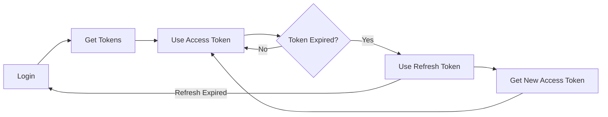

# X-Clone API Authentication Guide

**Authentication Method**: JWT Bearer Tokens  
**Token Type**: JSON Web Tokens (JWT)  
**Algorithm**: HS256

---

## 🔐 Authentication Overview

The X-Clone API uses **JWT Bearer tokens** for authentication. All protected endpoints require a valid access token in the `Authorization` header.

```
Authorization: Bearer YOUR_ACCESS_TOKEN
```

---

## 🚀 Quick Start

### **1. Register a New User**
```bash
curl -X POST "http://your-domain.com/api/auth/register" \
  -H "Content-Type: application/json" \
  -d '{
    "email": "user@example.com",
    "password": "securepassword123",
    "name": "John Doe",
    "handle": "johndoe"
  }'
```

**Response**:
```json
{
  "accessToken": "eyJhbGciOiJIUzI1NiJ9.eyJzdWIiOiJ1c2VyLWlkIiwiZW1haWwiOiJ1c2VyQGV4YW1wbGUuY29tIiwidHlwZSI6ImFjY2VzcyIsImlhdCI6MTc2ODU0NTkwNCwiZXhwIjoxNzY4NTQ2ODA0fQ.signature",
  "refreshToken": "eyJhbGciOiJIUzI1NiJ9.eyJzdWIiOiJ1c2VyLWlkIiwiZW1haWwiOiJ1c2VyQGV4YW1wbGUuY29tIiwidHlwZSI6InJlZnJlc2giLCJpYXQiOjE3Njg1NDU5MDQsImp0aSI6InRva2VuLWlkIiwiZXhwIjoxNzY5MTUwNzA0fQ.signature",
  "user": {
    "id": "user-uuid",
    "email": "user@example.com",
    "profile": {
      "name": "John Doe",
      "handle": "johndoe"
    }
  }
}
```

### **2. Login with Existing Account**
```bash
curl -X POST "http://your-domain.com/api/auth/login" \
  -H "Content-Type: application/json" \
  -d '{
    "email": "user@example.com",
    "password": "securepassword123"
  }'
```

**Response**: Same as registration

---

## 🎫 Token Types

### **Access Token**
- **Purpose**: Authenticate API requests
- **Expiration**: 15 minutes
- **Usage**: Include in `Authorization` header
- **Format**: `Bearer {accessToken}`

### **Refresh Token**
- **Purpose**: Obtain new access tokens
- **Expiration**: 7 days
- **Usage**: Send to `/api/auth/refresh` endpoint
- **Storage**: Secure, HTTP-only cookies recommended

---

## 🔄 Token Lifecycle



---

## 📝 Implementation Examples

### **JavaScript/TypeScript**

```typescript
class APIClient {
  private accessToken: string = '';
  private refreshToken: string = '';
  private baseURL: string = 'http://your-domain.com/api';

  async login(email: string, password: string) {
    const response = await fetch(`${this.baseURL}/auth/login`, {
      method: 'POST',
      headers: { 'Content-Type': 'application/json' },
      body: JSON.stringify({ email, password })
    });

    const data = await response.json();
    this.accessToken = data.accessToken;
    this.refreshToken = data.refreshToken;
    
    // Store tokens securely
    localStorage.setItem('refreshToken', this.refreshToken);
    
    return data;
  }

  async refreshAccessToken() {
    const response = await fetch(`${this.baseURL}/auth/refresh`, {
      method: 'POST',
      headers: { 'Content-Type': 'application/json' },
      body: JSON.stringify({ refreshToken: this.refreshToken })
    });

    const data = await response.json();
    this.accessToken = data.accessToken;
    return data;
  }

  async makeAuthenticatedRequest(endpoint: string, options: RequestInit = {}) {
    const headers = {
      ...options.headers,
      'Authorization': `Bearer ${this.accessToken}`
    };

    let response = await fetch(`${this.baseURL}${endpoint}`, {
      ...options,
      headers
    });

    // Auto-refresh on 401
    if (response.status === 401) {
      await this.refreshAccessToken();
      headers['Authorization'] = `Bearer ${this.accessToken}`;
      response = await fetch(`${this.baseURL}${endpoint}`, {
        ...options,
        headers
      });
    }

    return response.json();
  }
}

// Usage
const client = new APIClient();
await client.login('user@example.com', 'password123');
const user = await client.makeAuthenticatedRequest('/auth/me');
```

### **Python**

```python
import requests
from datetime import datetime, timedelta

class APIClient:
    def __init__(self, base_url='http://your-domain.com/api'):
        self.base_url = base_url
        self.access_token = None
        self.refresh_token = None
        self.token_expiry = None

    def login(self, email, password):
        response = requests.post(f'{self.base_url}/auth/login', json={
            'email': email,
            'password': password
        })
        response.raise_for_status()
        
        data = response.json()
        self.access_token = data['accessToken']
        self.refresh_token = data['refreshToken']
        self.token_expiry = datetime.now() + timedelta(minutes=15)
        
        return data

    def refresh_access_token(self):
        response = requests.post(f'{self.base_url}/auth/refresh', json={
            'refreshToken': self.refresh_token
        })
        response.raise_for_status()
        
        data = response.json()
        self.access_token = data['accessToken']
        self.token_expiry = datetime.now() + timedelta(minutes=15)
        
        return data

    def make_authenticated_request(self, method, endpoint, **kwargs):
        # Check if token needs refresh
        if self.token_expiry and datetime.now() >= self.token_expiry:
            self.refresh_access_token()

        headers = kwargs.get('headers', {})
        headers['Authorization'] = f'Bearer {self.access_token}'
        kwargs['headers'] = headers

        response = requests.request(method, f'{self.base_url}{endpoint}', **kwargs)
        
        # Auto-refresh on 401
        if response.status_code == 401:
            self.refresh_access_token()
            headers['Authorization'] = f'Bearer {self.access_token}'
            response = requests.request(method, f'{self.base_url}{endpoint}', **kwargs)

        return response.json()

# Usage
client = APIClient()
client.login('user@example.com', 'password123')
user = client.make_authenticated_request('GET', '/auth/me')
```

---

## 🔒 Security Best Practices

### **1. Token Storage**

**✅ DO**:
- Store refresh tokens in HTTP-only cookies (web)
- Use secure storage (Keychain on iOS, KeyStore on Android)
- Encrypt tokens before storing in localStorage
- Clear tokens on logout

**❌ DON'T**:
- Store tokens in plain localStorage (XSS vulnerable)
- Log tokens to console
- Include tokens in URLs
- Commit tokens to version control

### **2. Token Transmission**

**✅ DO**:
- Always use HTTPS in production
- Include tokens in `Authorization` header
- Validate SSL certificates

**❌ DON'T**:
- Send tokens over HTTP
- Include tokens in query parameters
- Share tokens between users

### **3. Token Refresh**

**✅ DO**:
- Implement automatic token refresh
- Handle 401 errors gracefully
- Refresh proactively before expiration

**❌ DON'T**:
- Wait for 401 to refresh
- Retry failed requests without refreshing
- Ignore token expiration

---

## 🛡️ Error Handling

### **Common Authentication Errors**

| Status | Error | Cause | Solution |
|--------|-------|-------|----------|
| 401 | Unauthorized | Missing/invalid token | Re-authenticate |
| 401 | Token expired | Access token expired | Use refresh token |
| 401 | Invalid credentials | Wrong email/password | Check credentials |
| 403 | Forbidden | Insufficient permissions | Check user role |
| 429 | Too many requests | Rate limit exceeded | Implement backoff |

### **Error Response Format**
```json
{
  "error": "Invalid credentials",
  "code": "AUTH_FAILED"
}
```

---

## 🧪 Testing Authentication

### **Test with cURL**
```bash
# 1. Login
TOKEN=$(curl -s -X POST "http://your-domain.com/api/auth/login" \
  -H "Content-Type: application/json" \
  -d '{"email":"user1@xclone.com","password":"password123"}' \
  | jq -r '.accessToken')

# 2. Use token
curl -X GET "http://your-domain.com/api/auth/me" \
  -H "Authorization: Bearer $TOKEN"

# 3. Test invalid token (should return 401)
curl -X GET "http://your-domain.com/api/auth/me" \
  -H "Authorization: Bearer invalid.token.here"
```

### **Test Credentials**
```
Email: user1@xclone.com
Password: password123
```

---

## 📊 Token Payload

### **Access Token Payload**
```json
{
  "sub": "user-uuid",
  "email": "user@example.com",
  "type": "access",
  "iat": 1768545904,
  "exp": 1768546804
}
```

### **Refresh Token Payload**
```json
{
  "sub": "user-uuid",
  "email": "user@example.com",
  "type": "refresh",
  "iat": 1768545904,
  "jti": "token-uuid",
  "exp": 1769150704
}
```

---

## 🔄 Token Refresh Flow

```bash
# When access token expires
curl -X POST "http://your-domain.com/api/auth/refresh" \
  -H "Content-Type: application/json" \
  -d '{"refreshToken":"YOUR_REFRESH_TOKEN"}'
```

**Response**:
```json
{
  "accessToken": "new.access.token",
  "refreshToken": "new.refresh.token"
}
```

---

## ✅ Checklist for Integration

- [ ] Implement login/register flow
- [ ] Store tokens securely
- [ ] Add Authorization header to requests
- [ ] Implement token refresh logic
- [ ] Handle 401 errors
- [ ] Clear tokens on logout
- [ ] Use HTTPS in production
- [ ] Implement rate limiting
- [ ] Add error handling
- [ ] Test authentication flow

---

## 📞 Support

For authentication issues:
1. Check token format: `Bearer {token}`
2. Verify token hasn't expired
3. Ensure HTTPS is used
4. Check CORS configuration
5. Contact API administrator
